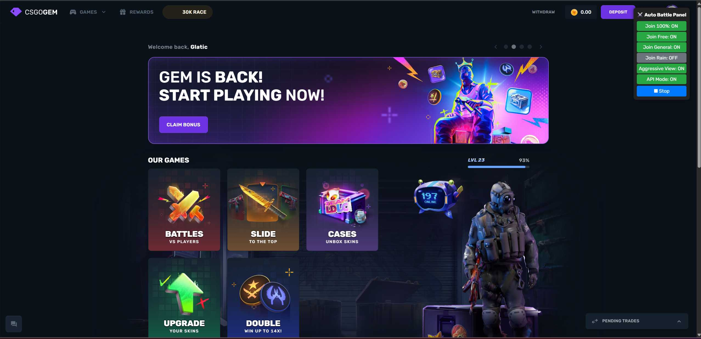

# CSGOGem Auto Battle Bot Extension

## Features

- **Join 100% Battle**  
  Automatically joins battles with 100% discount.

- **Join Free Battle**  
  Automatically joins free battles.

- **Join General Battle**  
  Automatically joins general battles.

- **Join Rain Event**  
  Automatically joins "Rain" events and notifies you when a rain event is detected.

- **Aggressive View**  
  Automatically clicks the "View" button on 100% battles.

- **API Mode**  
  Joins battles using the API (requires manual auth token).

## Controls

- **Control Panel**  
  After the extension is active, a panel appears at the top right of the page.
- **Toggle Buttons**  
  Enable/disable features by clicking the buttons in the panel.
- **Start/Stop Button**  
  Start or stop the bot with the Start/Stop button in the panel.
- **Keyboard Shortcuts**  
  - `Insert` : Start the bot  
  - `Delete` : Stop the bot  
  - `Fn + 1/2/3/4/5/6` : Toggle features in order as shown in the panel

## How to Install

1. **Download or clone** this repository.
2. Open your browser (Chrome/Edge/Brave).
3. Go to the Extensions page (`chrome://extensions/`).
4. Enable **Developer mode** (top right).
5. Click **Load unpacked**.
6. Select the folder containing `content.js` and the manifest.json
7. Open [csgogem.com](https://csgogem.com/) and the Auto Battle Panel will appear automatically.

---

## Donation

If you find this project helpful and want to support further development, you can donate via:
 
- **ETH/BNB/POLYGON/USDT/USDC:** 0xbea04d6afad0a2ecf892d7a89a83e03e2f94745d  
- **LTC:** MDG3p9VBEA2osJ3F3N2eXaGRkYcmKnpeDx  
- **SOL:** 4zLHwj4dmutUkBbMZxnLFnHfSATWxo7ThsSarAqcfe3A
- **TRON/TRX:** TE3RHU4LwLYDmNYgiX2ppqDZY9oTKByzKD
- **BTC:** bc1p89n303vs5092zphapgws26a6yycc7u5zwvg3637fzv50ewtv7rpsdfwmk8
Thank you for your support!

---
